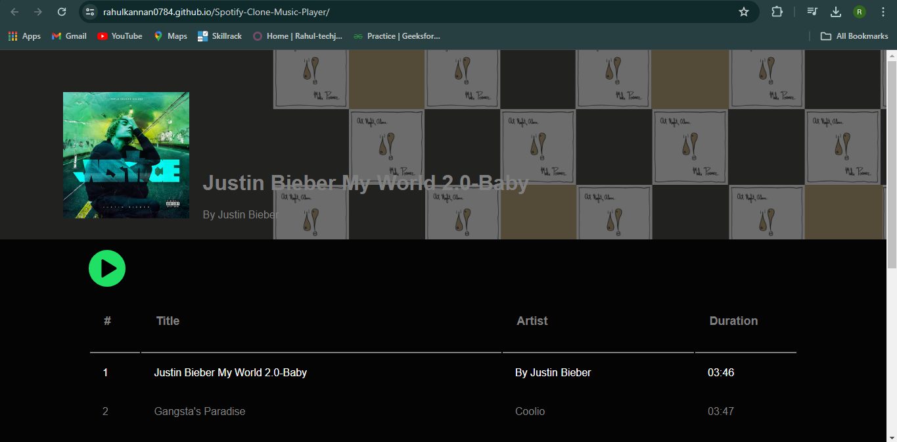

# Spotify Clone Music Player

This is a simple Spotify clone music player created using HTML, CSS, and JavaScript.

## Features
- Play/pause music
- Skip to next/previous track
- Display current playing track
- Volume control

## Technologies Used
- HTML
- CSS
- JavaScript

## Getting Started
To run the music player, simply open the `index.html` file in your web browser.

## Website Link
[Live Demo](https://rahulkannan0784.github.io/Spotify-Clone-Music-Player/)
